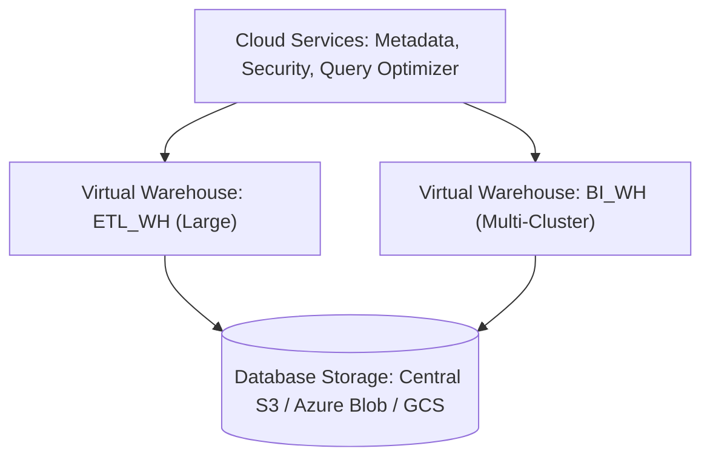
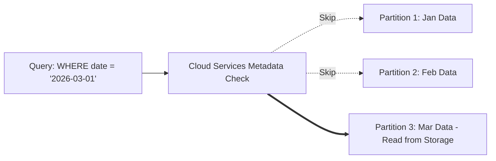
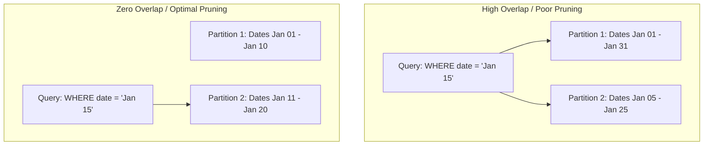

# Snowflake Interview Notes — Day 1


- Track: Revature Data Engineering
- Module: Snowflake Cloud Data Platform
- Day: Day 1 — Fundamentals & Architecture
- Focus: Fast, structured interview revision (2–3 minute read per topic)

---

## Table of Contents
1. [Snowflake Introduction & Setup](#1-snowflake-introduction--setup)
2. [Architecture Overview](#2-architecture-overview)
3. [Virtual Warehouses](#3-virtual-warehouses)
4. [Micro-Partitioning Mechanics](#4-micro-partitioning-mechanics)
5. [How Data Is Physically Stored](#5-how-data-is-physically-stored)
6. [Clustering at Storage Level](#6-clustering-at-storage-level)
7. [Day 1 Quick Revision](#day-1-quick-revision)

---

## 1. Snowflake Introduction & Setup

### Definition
Snowflake is a fully managed cloud Data Platform delivered as Software-as-a-Service (SaaS). It runs on AWS, Azure, or GCP and completely decouples compute from storage. It eliminates traditional database administration tasks such as server sizing, disk provisioning, software patching, and index tuning.

### Simple Explanation
Instead of purchasing and managing physical database servers, you rent Snowflake over the internet. You store data in central cloud storage and start compute clusters only when queries need to execute, paying only for the exact compute time consumed.

### Practical Setup SQL

```sql
-- 1. Create database and schema
CREATE DATABASE IF NOT EXISTS revature_dw;
CREATE SCHEMA IF NOT EXISTS revature_dw.raw_data;

-- 2. Create a cost-controlled virtual warehouse
CREATE WAREHOUSE IF NOT EXISTS dev_wh WITH
    WAREHOUSE_SIZE = 'XSMALL'
    AUTO_SUSPEND = 60
    AUTO_RESUME = TRUE
    INITIALLY_SUSPENDED = TRUE
    COMMENT = 'Development warehouse with 60-second auto-suspend';

-- 3. Verify session context
SELECT
    CURRENT_ROLE()      AS active_role,
    CURRENT_WAREHOUSE() AS active_warehouse,
    CURRENT_DATABASE()  AS active_database,
    CURRENT_SCHEMA()    AS active_schema;
```

### Real-Life Scenario
A retail enterprise ingests daily CSV transactions from retail stores and real-time JSON clickstream events from mobile apps directly into Snowflake. Data engineers query both formats using standard SQL without needing specialized NoSQL databases or manual server tuning.

### Interview Questions
- **Q: What makes Snowflake a true SaaS data platform?**
  - **Answer:** Snowflake manages all hardware, availability, clustering, software updates, and tuning. Users manage only their data, access controls, and SQL queries.
- **Q: Can Snowflake be deployed on-premises?**
  - **Answer:** No. Snowflake is 100% cloud-native and runs exclusively on public cloud providers (AWS, Azure, GCP).

### Interview Spoken Answer
> "Snowflake is a fully managed cloud SaaS data platform that completely decouples compute from storage. It eliminates infrastructure maintenance like patching, indexing, and manual capacity planning while offering per-second pay-as-you-go pricing."

---

## 2. Architecture Overview

### Definition
Snowflake uses a patented 3-tier Multi-Cluster Shared Data Architecture that logically and physically decouples Database Storage, Compute (Query Processing), and Cloud Services. This design eliminates resource contention between competing workloads.

### Simple Explanation
- **Cloud Services:** The brain coordinating security, metadata, query optimization, and transactions.
- **Compute Layer:** Independent, stateless Virtual Warehouses executing queries.
- **Storage Layer:** Central cloud object storage holding immutable, columnar micro-partitions.

### Architecture Flow



### Key Technical Advantage
Zero resource contention. An ETL batch pipeline can write millions of rows on one warehouse while hundreds of BI users query the same table on another warehouse without locks or performance degradation.

### Metadata Query Example

```sql
-- Resolves entirely in Cloud Services without waking a virtual warehouse
SELECT COUNT(*) AS total_rows FROM revature_dw.raw_data.orders;
```

### Architectural Layer Comparison

| Layer | Technology | Primary Function | State |
| :--- | :--- | :--- | :--- |
| Cloud Services | Global Control Plane | Authentication, metadata catalog, query optimizer, ACID transactions | Managed |
| Compute Layer | Virtual Warehouses | MPP clusters executing queries, joins, and aggregations | Stateless |
| Storage Layer | Cloud Object Storage | Encrypted, compressed, immutable micro-partitions | Persistent |

### Interview Questions
- **Q: What are the three layers of Snowflake architecture?**
  - **Answer:** Cloud Services Layer, Query Processing (Compute) Layer, and Database Storage Layer.
- **Q: Does dropping or suspending a Virtual Warehouse cause data loss?**
  - **Answer:** No. Virtual Warehouses are stateless compute nodes. All data resides permanently and safely in the storage layer.

### Interview Spoken Answer
> "Snowflake's architecture consists of three decoupled layers: Cloud Services manages metadata, optimization, and security; the Compute layer uses isolated Virtual Warehouses to execute queries without resource contention; and the Storage layer stores data permanently in cloud object storage as immutable micro-partitions."

---

## 3. Virtual Warehouses

### Definition
A Virtual Warehouse is an independent Massively Parallel Processing (MPP) compute cluster composed of CPU, memory, and local SSD cache used to execute SQL queries and DML statements.

### Simple Explanation
It is the computing horsepower in Snowflake. You select a T-shirt size based on workload complexity, and Snowflake meters usage on a per-second basis with a 60-second minimum whenever the warehouse runs.

### Scale-Up vs Scale-Out

| Scaling Type | Mechanism | Primary Problem Solved |
| :--- | :--- | :--- |
| **Scale-Up (Vertical)** | Increase size: X-Small (1 node) to 6X-Large (512 nodes) | Accelerates a single heavy, complex, or long-running query |
| **Scale-Out (Horizontal)** | Add clusters: 1 to N clusters (Multi-Cluster Warehouse) | Absorbs high user concurrency and eliminates query queuing |

### Warehouse Management SQL

```sql
-- 1. Create a multi-cluster warehouse for high concurrency
CREATE WAREHOUSE IF NOT EXISTS bi_reporting_wh WITH
    WAREHOUSE_SIZE = 'MEDIUM'
    MIN_CLUSTER_COUNT = 1
    MAX_CLUSTER_COUNT = 4
    SCALING_POLICY = 'STANDARD'
    AUTO_SUSPEND = 120
    AUTO_RESUME = TRUE;

-- 2. Scale up vertically on demand for heavy batch ETL
ALTER WAREHOUSE bi_reporting_wh SET WAREHOUSE_SIZE = 'LARGE';

-- 3. Suspend warehouse immediately to save credits
ALTER WAREHOUSE bi_reporting_wh SUSPEND;
```

### Key Cost Best Practice
Always configure `AUTO_SUSPEND` (60–120 seconds) and `AUTO_RESUME = TRUE` on every warehouse to eliminate idle credit consumption.

### Interview Questions
- **Q: Does resizing a warehouse affect queries currently running on it?**
  - **Answer:** No. Running queries complete on the original cluster size; newly arriving queries execute on the resized cluster.
- **Q: What is the difference between STANDARD and ECONOMY scaling policies?**
  - **Answer:** STANDARD starts additional clusters immediately when queries begin queuing. ECONOMY waits up to 6 minutes to confirm sustained load before starting a new cluster.

### Interview Spoken Answer
> "A Virtual Warehouse is a stateless compute cluster in Snowflake. We scale it up vertically to speed up complex queries, and scale it out horizontally using multi-cluster warehouses to service hundreds of concurrent users without query queuing. Auto-suspend and auto-resume ensure compute is billed strictly for active query runtimes."

---

## 4. Micro-Partitioning Mechanics

### Definition
Micro-partitioning is Snowflake's automated storage scheme where tables are divided into contiguous, 50 MB to 500 MB uncompressed units of columnar storage. Snowflake captures column-level min/max metadata for every micro-partition to enable partition pruning without manual partition management.

### Simple Explanation
Instead of manually creating date or regional partition folders, Snowflake automatically slices table data into small files upon ingestion. It records the minimum and maximum value of each column in Cloud Services metadata, allowing queries to skip scanning irrelevant files.

### Pruning Flow



### Partition Pruning Example

```sql
-- Pruning in action: Snowflake scans only partitions overlapping '2026-03-01'
SELECT order_id, customer_id, order_total
FROM sales_orders
WHERE order_date = '2026-03-01';
```

### Micro-Partitioning vs Traditional Partitioning

| Dimension | Snowflake Micro-Partitioning | Traditional Static Partitioning (Hive, RDBMS) |
| :--- | :--- | :--- |
| **Management** | 100% automated by Snowflake | Manual DDL maintenance (`PARTITION BY`) |
| **File Sizing** | Uniform (50 MB to 500 MB) | Highly variable; prone to data skew and small files |
| **Pruning** | Multi-dimensional based on all columns | Restricted to explicit partition key columns |

### Interview Questions
- **Q: What is partition pruning?**
  - **Answer:** The optimization process where Cloud Services checks micro-partition min/max metadata and skips reading files that do not match the query filter.
- **Q: What metadata is stored for each micro-partition?**
  - **Answer:** Minimum value, maximum value, distinct count, null count, and physical byte size for every column.

### Interview Spoken Answer
> "Micro-partitioning is Snowflake's automated storage system where tables are split into 50 to 500 MB columnar files. Cloud Services tracks min/max boundaries for every column in each partition, allowing the optimizer to prune away irrelevant files before retrieving data from storage."

---

## 5. How Data Is Physically Stored

### Definition
Snowflake physically stores data as encrypted, compressed, columnar-oriented immutable files inside cloud provider object storage (S3, Azure Blob, GCS). This layout optimizes analytical read operations by retrieving only queried columns and achieving 60% to 80% compression ratios.

### Simple Explanation
Transactional databases store records row by row (optimized for reading a single customer record). Snowflake stores data column by column, which is optimal for analytics because queries read only the specific columns requested rather than entire rows.

### Columnar Storage Efficiency

```sql
-- Scans ONLY the 'department' and 'salary' byte vectors from storage
SELECT department, AVG(salary) AS avg_salary
FROM employees
GROUP BY department;
```

### Row Store vs Columnar Store

| Feature | Row-Oriented (OLTP) | Columnar (Snowflake OLAP) |
| :--- | :--- | :--- |
| **Storage Layout** | Entire rows stored contiguously | Individual columns stored contiguously |
| **Best Workload** | Single-row INSERT, UPDATE, primary key lookups | Analytical aggregations (`SUM`, `AVG`, `COUNT`) |
| **I/O Efficiency** | Reads all columns in a row | Reads only columns referenced in query |
| **Compression** | Low (10% to 20%) | High (60% to 80%) due to uniform data types |

### Why Immutability Matters
Micro-partitions are write-once. Updates and deletes create new micro-partitions without in-place file modifications. This enables Time Travel, Zero-Copy Cloning, and lock-free concurrency.

### Interview Questions
- **Q: Why does columnar storage compress data more efficiently than row storage?**
  - **Answer:** In columnar storage, all values in a physical block share identical data types and similar distributions, allowing algorithms like dictionary encoding and run-length encoding to achieve high compression.
- **Q: What happens physically when an UPDATE statement is executed in Snowflake?**
  - **Answer:** Snowflake writes a brand-new micro-partition containing the updated rows and flags the old micro-partition as historical for Time Travel.

### Interview Spoken Answer
> "Snowflake stores data physically in encrypted, compressed, columnar immutable files in cloud object storage. Columnar storage minimizes I/O by reading only the columns needed by the query, while immutability provides lock-free concurrency and powers features like Time Travel."

---

## 6. Clustering at Storage Level

### Definition
Clustering refers to the physical grouping and alignment of records across micro-partitions based on designated table columns (Clustering Keys) to eliminate micro-partition overlap.

### Simple Explanation
Snowflake naturally clusters data by insertion order. On very large multi-terabyte tables where queries filter on columns that differ from insertion order, an explicit clustering key groups related data into the same files so queries scan significantly fewer micro-partitions.

### Partition Overlap Diagram



### Clustering Key SQL

```sql
-- 1. Define clustering key on a multi-terabyte table
CREATE OR REPLACE TABLE store_transactions (
    transaction_id NUMBER,
    store_country VARCHAR,
    sale_date DATE,
    sale_amount NUMBER(10,2)
) CLUSTER BY (store_country, sale_date);

-- 2. Check clustering health (target average_depth is close to 1.0)
SELECT SYSTEM$CLUSTERING_INFORMATION('store_transactions');
```

### Important Rule of Thumb
Only define explicit clustering keys on tables larger than several hundred gigabytes or multi-terabytes with confirmed partition pruning bottlenecks. Small tables already occupy very few micro-partitions and should never be explicitly clustered.

### Interview Questions
- **Q: What is clustering depth?**
  - **Answer:** The average number of overlapping micro-partitions for a table's clustering key. A depth near 1.0 represents optimal clustering.
- **Q: Does Snowflake have traditional B-Tree indexes?**
  - **Answer:** No. Snowflake relies on micro-partition metadata, columnar storage, and clustering keys instead of indexes.

### Interview Spoken Answer
> "Clustering in Snowflake is the physical co-location of data within micro-partitions along specific columns. While tables naturally cluster on ingestion, defining an explicit clustering key on massive tables eliminates partition overlap, allowing the serverless Automatic Clustering service to maintain optimal query pruning."

---

## Day 1 Quick Revision

### Core Takeaways
1. **SaaS Platform:** Pure cloud service on AWS, Azure, or GCP with zero physical DBA overhead.
2. **3-Tier Architecture:** Decoupled Cloud Services (metadata & control), Compute (Virtual Warehouses), and Storage (cloud object storage).
3. **Virtual Warehouses:** Stateless compute clusters that scale up for query complexity and scale out for user concurrency.
4. **Micro-Partitioning:** Automatic 50 MB to 500 MB columnar files with min/max metadata used for partition pruning.
5. **Columnar Storage:** Reads only queried columns from storage, delivering 60–80% compression and minimal I/O.
6. **Clustering Keys:** Used only on multi-terabyte tables to eliminate partition overlap and restore query pruning.

### Must-Know SQL Reference

```sql
-- Warehouse lifecycle
CREATE WAREHOUSE dev_wh WITH WAREHOUSE_SIZE = 'XSMALL' AUTO_SUSPEND = 60 AUTO_RESUME = TRUE;
ALTER WAREHOUSE dev_wh SET WAREHOUSE_SIZE = 'LARGE';
ALTER WAREHOUSE dev_wh SUSPEND;

-- Metadata query (zero compute cost)
SELECT COUNT(*) FROM table_name;

-- Clustering health evaluation
SELECT SYSTEM$CLUSTERING_INFORMATION('table_name');
```

### High-Frequency Interview Q&A
1. **Q: Can metadata queries run when all warehouses are suspended?**
   - **A:** Yes. Metadata queries (like `COUNT(*)`, `MIN()`, `MAX()`) resolve inside Cloud Services at zero compute cost.
2. **Q: What is the minimum billing duration for a Snowflake warehouse?**
   - **A:** 60 seconds. After the first minute, billing meters per second.
3. **Q: Why are micro-partitions immutable?**
   - **A:** Immutability enables lock-free read/write concurrency, Time Travel, and Zero-Copy Cloning.
4. **Q: How does Snowflake handle scaling for high user concurrency?**
   - **A:** By using Multi-Cluster Warehouses (Scale-Out) to automatically spin up additional clusters of the same size.
5. **Q: When should you define an explicit clustering key?**
   - **A:** Only on very large tables (multi-hundred GB or TB scale) where queries exhibit poor partition pruning.
