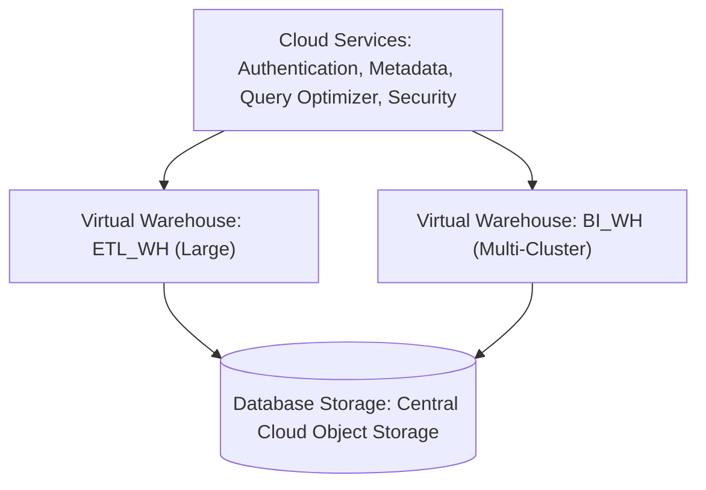
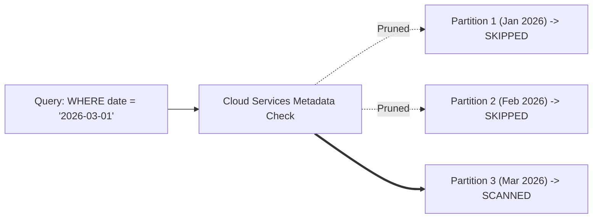
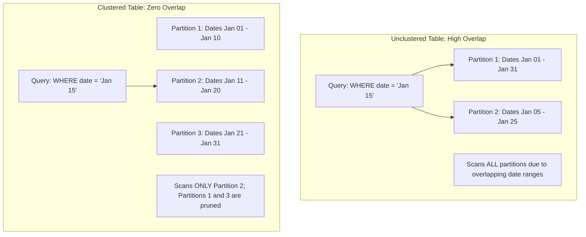
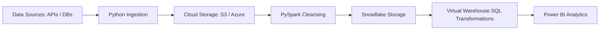

# Revature Data Engineering Interview Notes

## Day 1 — Snowflake Fundamentals & Architecture


- Technology: Snowflake Cloud Data Platform
- Day Covered: Day 1
- Focus: Fast Interview Revision — Architecture, Virtual Warehouses, Micro-Partitions, Columnar Storage, and Clustering.

---

## Table of Contents
- [1. Snowflake Introduction & Setup](#1-snowflake-introduction--setup)
- [2. Architecture Overview](#2-architecture-overview)
- [3. Virtual Warehouses](#3-virtual-warehouses)
- [4. Micro-Partitioning Mechanics](#4-micro-partitioning-mechanics)
- [5. How Data Is Physically Stored](#5-how-data-is-physically-stored)
- [6. Clustering at Storage Level](#6-clustering-at-storage-level)
- [Day 1 — Quick Revision](#day-1--quick-revision)
- [Final Interview Revision](#final-interview-revision)

---

### 1. Snowflake Introduction & Setup

#### Definition
Snowflake is a fully managed cloud Data Platform delivered as a Software-as-a-Service (SaaS) solution for data warehousing, data lakes, and data engineering. It completely decouples compute from storage, allowing both to scale independently and elastically. It eliminates physical administrative tasks such as server provisioning, hardware maintenance, software updates, and manual indexing.

#### Simple Explanation
Instead of buying, installing, and tuning database servers in your own data center, you rent Snowflake as a managed cloud service over the internet. Storage is stored centrally in the cloud, while compute clusters are started only when needed to run queries.

#### Example

```sql
-- Verify active session context in Snowflake
SELECT
    CURRENT_ACCOUNT()   AS current_account,
    CURRENT_ROLE()      AS current_role,
    CURRENT_WAREHOUSE() AS current_warehouse,
    CURRENT_DATABASE()  AS current_database,
    CURRENT_SCHEMA()    AS current_schema;
```

#### What it does
Returns the active account ID, user role, compute warehouse, and database context for the current session.

#### Output

| CURRENT_ACCOUNT | CURRENT_ROLE | CURRENT_WAREHOUSE | CURRENT_DATABASE | CURRENT_SCHEMA |
| :--- | :--- | :--- | :--- | :--- |
| XY12345 | SYSADMIN | COMPUTE_WH | REVATURE_DW | PUBLIC |

#### Key Point
Snowflake runs entirely on public cloud infrastructure (AWS, Azure, or GCP) and requires zero infrastructure installation or manual database indexing.

#### Real-Life Scenario
A retail enterprise receives millions of point-of-sale transactions and mobile JSON clickstream records daily. Rather than hiring database administrators to manage physical servers and tune disk partitions, data engineers load raw data directly into Snowflake and query it immediately using standard SQL.

#### Common Mistakes
- Using the `ACCOUNTADMIN` role for everyday data engineering pipelines instead of least-privilege roles like `SYSADMIN`.
- Forgetting to configure auto-suspend on compute resources, leading to unnecessary credit charges.

#### Interview Questions
**Q1: What type of cloud service model is Snowflake?**
**Answer:** Snowflake is a pure Software-as-a-Service (SaaS) offering. Snowflake manages all infrastructure, availability, security, tuning, and software updates.

**Q2: Can Snowflake run on an on-premises data center?**
**Answer:** No. Snowflake is entirely cloud-native and operates exclusively on AWS, Azure, or GCP.

#### Interview Answer
> "Snowflake is a fully managed cloud data platform delivered as SaaS. It decouples compute from storage, allowing each to scale independently and elastically. This eliminates infrastructure management, hardware maintenance, and manual tuning while providing true pay-as-you-go pricing."

---

### 2. Architecture Overview

#### Definition
Snowflake utilizes a patented 3-tier Multi-Cluster Shared Data Architecture that logically and physically separates Database Storage, Compute (Query Processing), and Cloud Services. This design eliminates resource contention between concurrent workloads and allows storage and compute to scale independently.

#### Simple Explanation
1. Storage Layer: Central repository in cloud object storage storing immutable data files.
2. Compute Layer: Independent Virtual Warehouses that execute queries without competing for CPU or RAM.
3. Cloud Services Layer: The brain of Snowflake coordinating authentication, metadata, query optimization, and transactions.

#### Flow



Cloud Services coordinates the request -> Independent Virtual Warehouses process the data -> Both read from the shared central Storage layer.

#### Example

```sql
-- Metadata-only query: resolves in Cloud Services without waking a warehouse
SELECT COUNT(*) AS total_records FROM revature_dw.public.orders;
```

#### What it does
Cloud Services checks the stored micro-partition metadata and returns the row count instantly at zero compute credit cost.

#### Output

| TOTAL_RECORDS |
| :--- |
| 15000000 |

#### Key Point
Because compute is separate from storage, multiple virtual warehouses can query the exact same underlying table simultaneously with zero lock contention or performance degradation.

#### Real-Life Scenario
At month-end, the finance team runs complex BI aggregations on a Large warehouse, while the data engineering team runs batch data ingestion pipelines on an X-Small warehouse against the exact same tables. Neither team experiences query queuing or performance slowdowns.

#### Comparison: Architecture Layers

| Layer | Component | Function |
| :--- | :--- | :--- |
| Cloud Services | Global Coordinator | Authentication, metadata catalog, query compilation, ACID control |
| Compute Layer | Virtual Warehouses | Stateless MPP clusters executing SQL queries, joins, and aggregations |
| Storage Layer | Cloud Object Storage | Encrypted, compressed, immutable micro-partitions on S3 / Blob / GCS |

#### Interview Questions
**Q1: What are the three layers of Snowflake architecture?**
**Answer:** The Cloud Services Layer, the Query Processing (Compute) Layer, and the Database Storage Layer.

**Q2: Does dropping or suspending a Virtual Warehouse delete any table data?**
**Answer:** No. Virtual Warehouses are stateless compute resources. All persistent data resides independently in the cloud storage layer.

#### Interview Answer
> "Snowflake uses a 3-tier architecture separating Cloud Services, Compute, and Storage. Storage stores data permanently in cloud object storage. Compute executes queries using isolated Virtual Warehouses with zero resource contention. Cloud Services coordinates authentication, metadata tracking, and query optimization."

---

### 3. Virtual Warehouses

#### Definition
A Virtual Warehouse is an independent cluster of compute resources (CPU, RAM, and local SSD cache) used to execute SQL queries, DML statements, and data loading tasks. Virtual Warehouses provide elastic processing capacity decoupled from storage, enabling fine-grained cost governance and isolated workload execution.

#### Simple Explanation
A Virtual Warehouse is the computing engine that performs the work in Snowflake. You can adjust its size (T-shirt sizes from X-Small to 6X-Large) depending on query complexity, and configure it to shut down automatically when idle so you stop paying for compute.

#### Example

```sql
-- Create an auto-suspending, auto-resuming compute warehouse
CREATE WAREHOUSE IF NOT EXISTS etl_wh WITH
    WAREHOUSE_SIZE = 'SMALL'
    AUTO_SUSPEND = 60
    AUTO_RESUME = TRUE
    INITIALLY_SUSPENDED = TRUE;

-- Scale up warehouse vertically for heavy batch operations
ALTER WAREHOUSE etl_wh SET WAREHOUSE_SIZE = 'LARGE';
```

#### What it does
Creates a Small warehouse (2 nodes) that sleeps after 60 seconds of idle time and wakes automatically on incoming queries, then resizes it dynamically to Large (8 nodes).

#### Key Point
Scaling a warehouse up or down does not interrupt running queries; currently running queries complete on the original size, while subsequent queries run on the new size.

#### Real-Life Scenario
A nightly batch transformation pipeline runs at 02:00 AM. The pipeline alters its assigned warehouse from Small to X-Large before starting, finishes the transformation in 10 minutes instead of 2 hours, and auto-suspends immediately, saving cloud compute costs.

#### Comparison: Scale-Up vs Scale-Out

| Feature | Scale-Up (Vertical Scaling) | Scale-Out (Horizontal Scaling) |
| :--- | :--- | :--- |
| Action | Changes warehouse T-shirt size (XS to L) | Adds multiple clusters of the same size (1 to N) |
| Solves | Query complexity and large data volumes | High user concurrency and query queuing |
| Benefit | Faster execution of a single massive query | Simultaneous execution for dozens of concurrent users |

#### Interview Questions
**Q1: How is compute billed in Snowflake?**
**Answer:** Virtual Warehouses are billed per-second based on their T-shirt size, with a 60-second minimum charge every time a warehouse resumes.

**Q2: What is the difference between STANDARD and ECONOMY scaling policies?**
**Answer:** STANDARD starts additional clusters immediately when queries begin queuing. ECONOMY conserves credits by waiting to ensure there is enough sustained load (roughly 6 minutes) before starting a new cluster.

#### Interview Answer
> "A Virtual Warehouse in Snowflake is an independent compute cluster used to run queries and data transformations. Warehouses are stateless and decoupled from storage. We scale them up vertically to speed up complex queries, and scale them out horizontally using multi-cluster warehouses to handle high user concurrency without query queuing."

---

### 4. Micro-Partitioning Mechanics

#### Definition
Micro-partitioning is Snowflake's automated data partitioning scheme where all table data is divided into contiguous, 50 MB to 500 MB uncompressed units of columnar storage. Snowflake automatically captures column-level min/max metadata for every micro-partition to enable aggressive partition pruning without manual partition maintenance.

#### Simple Explanation
Instead of manually partitioning tables by month or country, Snowflake automatically slices table data into small, manageable files. It records the minimum and maximum values of every column in each file, allowing the query optimizer to skip scanning files that do not match query filters.

#### Flow



Cloud Services checks metadata -> Prunes non-matching partitions -> Compute scans only matching files.

#### Example

```sql
-- Query benefits from automatic micro-partition pruning
SELECT order_id, customer_id, order_total
FROM sales_orders
WHERE order_date = '2026-03-01';
```

#### What it does
Snowflake evaluates the `WHERE` condition against partition metadata and scans only the micro-partitions containing records for that specific date, skipping all other files.

#### Key Point
Partition pruning occurs at the metadata layer before data is read from cloud storage, saving disk I/O, compute time, and credit costs.

#### Real-Life Scenario
A 5-terabyte audit table contains 3 billion historical records. An investigator searches for actions on a specific day. Rather than scanning all 5 terabytes, Snowflake prunes 99.8% of micro-partitions using metadata and returns the result in 3 seconds.

#### Comparison: Micro-Partitioning vs Traditional Partitioning

| Dimension | Snowflake Micro-Partitioning | Traditional Static Partitioning (Hive, RDBMS) |
| :--- | :--- | :--- |
| Creation | Fully automated; no DDL declaration | Manual DDL required (`PARTITION BY (col)`) |
| Partition Size | Uniform and controlled (50 MB to 500 MB) | Variable; prone to data skew and small files |
| Pruning Capability | Multi-dimensional based on all columns | Pruning limited only to defined partition keys |

#### Interview Questions
**Q1: What is the size of a micro-partition in Snowflake?**
**Answer:** Between 50 MB and 500 MB of uncompressed data, which typically compresses down to 10 MB to 50 MB.

**Q2: What metadata does Snowflake maintain for each micro-partition?**
**Answer:** The minimum value, maximum value, distinct count of values, count of NULL values, and physical byte size for every column.

#### Interview Answer
> "Micro-partitioning is Snowflake's automated storage system that splits table data into 50 to 500 MB columnar files. Cloud Services captures fine-grained metadata like min and max values for every column. When a query filters on a column, Snowflake uses this metadata to prune non-matching partitions, reading only the exact files required."

---

### 5. How Data Is Physically Stored

#### Definition
Snowflake physically stores data as encrypted, compressed, columnar-oriented immutable files within cloud provider object storage (AWS S3, Azure Blob, or Google Cloud Storage). This layout optimizes analytical read operations by retrieving only queried columns and achieving compression ratios between 60% and 80%.

#### Simple Explanation
Traditional transactional databases store records row by row, which is efficient for looking up single customer profiles. Snowflake stores data column by column, which is ideal for analytical aggregations because queries scan only the specific columns requested rather than entire rows.

#### Example

```sql
-- Columnar storage efficiency: reads only 2 columns, ignoring 40 other columns
SELECT department_id, AVG(salary) AS avg_salary
FROM employee_records
GROUP BY department_id;
```

#### What it does
Transfers only the physical byte blocks for `department_id` and `salary` from storage into compute memory, bypassing all other unreferenced columns.

#### Key Point
Micro-partitions are immutable (write-once). Updates and deletes never modify existing files; they write new micro-partitions and flag old ones as historical, enabling Time Travel and Zero-Copy Cloning.

#### Real-Life Scenario
A telemetry table contains 90 columns. A daily summary dashboard aggregates only `device_id`, `event_type`, and `battery_level`. Because data is stored columnarly, Snowflake scans less than 4% of the table's total physical bytes from storage.

#### Comparison: Row-Store vs Columnar-Store

| Feature | Row-Oriented Storage (OLTP) | Columnar Storage (Snowflake OLAP) |
| :--- | :--- | :--- |
| Storage Layout | Entire rows stored contiguously | Column values stored contiguously |
| Best For | Single-record INSERT, UPDATE, primary key lookups | Analytical queries, aggregations (`SUM`, `AVG`, `COUNT`) |
| Compression | Low (10% to 20%) | High (60% to 80%) due to uniform data types |

#### Interview Questions
**Q1: Why does columnar storage yield higher compression ratios?**
**Answer:** In columnar storage, every value in a physical block shares the identical data type and similar values, allowing compression algorithms like dictionary encoding and run-length encoding to compress data effectively.

**Q2: What happens physically when you execute an UPDATE statement in Snowflake?**
**Answer:** Because micro-partitions are immutable, Snowflake reads the existing micro-partition, writes a new micro-partition containing the updated rows, and marks the old micro-partition as historical.

#### Interview Answer
> "Snowflake physically stores data in encrypted, compressed, columnar immutable files inside cloud object storage. Columnar organization allows analytical queries to read only the specific columns needed, reducing I/O and enabling 60 to 80 percent compression ratios."

---

### 6. Clustering at Storage Level

#### Definition
Clustering refers to the physical grouping and alignment of records across micro-partitions based on one or more table columns. While Snowflake naturally clusters data upon ingestion, an explicit Clustering Key can be designated on massive multi-terabyte tables to eliminate micro-partition overlap and maximize partition pruning.

#### Simple Explanation
If records arrive randomly, records for the same customer or date are scattered across thousands of micro-partitions. Clustering reorganizes and groups related records into the same micro-partitions, so queries scan significantly fewer files.

#### Flow



#### Example

```sql
-- Define clustering key on a massive table
CREATE OR REPLACE TABLE sales_transactions (
    transaction_id NUMBER,
    store_country VARCHAR,
    sale_date DATE,
    sale_amount NUMBER(10,2)
) CLUSTER BY (store_country, sale_date);

-- Check clustering health and partition overlap depth
SELECT SYSTEM$CLUSTERING_INFORMATION('sales_transactions');
```

#### What it does
Instructs Snowflake to co-locate records with the same `store_country` and `sale_date` within the same micro-partitions, and checks clustering depth metrics.

#### Key Point
Clustering keys should only be defined on large tables (multi-hundred GB or TB scale) with documented pruning bottlenecks. Small tables should never be explicitly clustered.

#### Real-Life Scenario
An ad-tech platform queries a 12 TB clickstream table filtering by `(country, event_date)`. Because data arrived randomly by device ID, queries scanned 85% of micro-partitions. After defining a clustering key, queries scanned less than 3% of partitions, reducing runtime from 5 minutes to 6 seconds.

#### Interview Questions
**Q1: What is clustering depth in Snowflake?**
**Answer:** Clustering depth measures the average number of overlapping micro-partitions for a table's clustering key. A depth close to 1.0 represents optimal clustering.

**Q2: Does Snowflake have B-Tree indexes?**
**Answer:** No. Snowflake does not use indexes. It relies on micro-partition metadata, columnar storage, and clustering keys to optimize query performance.

#### Interview Answer
> "Clustering in Snowflake is the physical co-location of records within micro-partitions along designated columns. While tables cluster naturally on ingestion, very large multi-terabyte tables can experience partition overlap. Defining a clustering key enables Snowflake's serverless Automatic Clustering to reorganize micro-partitions, lowering clustering depth and restoring partition pruning."

---

## Day 1 — Quick Revision

### Key Concepts
- SaaS Cloud Platform: Fully managed service on AWS, Azure, or GCP with zero hardware administration.
- 3-Tier Architecture: Decoupled Cloud Services, Compute (Virtual Warehouses), and Storage layers.
- Virtual Warehouses: Stateless compute clusters that scale up for query complexity and scale out for concurrency.
- Micro-Partitioning: Automatic, uniform (50 to 500 MB) columnar storage units with column-level metadata.
- Columnar Physical Storage: Immutable, compressed files that minimize I/O for analytical aggregations.
- Storage Clustering: Reorganizing micro-partitions along clustering keys to eliminate overlap on multi-terabyte tables.

### Important Commands

```sql
-- Create an auto-suspending warehouse
CREATE WAREHOUSE dev_wh WITH
    WAREHOUSE_SIZE = 'XSMALL'
    AUTO_SUSPEND = 60
    AUTO_RESUME = TRUE
    INITIALLY_SUSPENDED = TRUE;

-- Scale up warehouse vertically
ALTER WAREHOUSE dev_wh SET WAREHOUSE_SIZE = 'LARGE';

-- Configure multi-cluster scale-out
ALTER WAREHOUSE dev_wh SET
    MIN_CLUSTER_COUNT = 1
    MAX_CLUSTER_COUNT = 4
    SCALING_POLICY = 'STANDARD';

-- Create table with clustering key
CREATE TABLE orders_fact (
    order_id NUMBER,
    region VARCHAR,
    order_date DATE
) CLUSTER BY (region, order_date);

-- Check clustering health
SELECT SYSTEM$CLUSTERING_INFORMATION('orders_fact');
```

### Interview Questions
1. Q: Can metadata queries run when a warehouse is suspended?
   - A: Yes. Metadata queries (such as `SELECT COUNT(*)`) resolve inside Cloud Services without activating compute.
2. Q: What happens to running queries when a warehouse is resized?
   - A: Running queries complete on the original size; subsequent queries use the new size.
3. Q: Why are micro-partitions immutable?
   - A: Immutability enables lock-free concurrency, Time Travel, and Zero-Copy Cloning.
4. Q: What is the recommended table size before considering an explicit clustering key?
   - A: Multi-hundred gigabytes or terabytes with poor partition pruning.
5. Q: What is the minimum billing duration for a Snowflake warehouse?
   - A: 60 seconds, followed by per-second metering.

### Quick Revision
Snowflake separates compute from storage across three layers: Cloud Services (metadata and coordination), Virtual Warehouses (stateless compute), and Cloud Object Storage (immutable micro-partitions). Compute scales up for complex queries and scales out for user concurrency. Data is stored in 50 to 500 MB compressed columnar micro-partitions. Cloud Services tracks min/max column values, enabling automated partition pruning without indexes. On massive tables, explicit clustering keys eliminate micro-partition overlap to maintain fast query execution.

---

## Final Interview Revision

### Technology Overview

| Technology | Main Purpose | Data Engineering Usage |
| :--- | :--- | :--- |
| Python | Programming & Scripting | REST API ingestion, custom transformations, pipeline automation |
| SQL & RDBMS | Relational Querying | Data modeling, business aggregations, ACID transactions |
| Cloud & DWH | Infrastructure & Storage | Centralized data lakehouse storage, decoupled compute scaling |
| PySpark | Distributed Processing | Large-scale data lake transformations, distributed batch jobs |
| Scala | Strongly Typed Big Data | High-performance Spark application development |
| Snowflake | Cloud Data Platform | Centralized Lakehouse/DWH, high-concurrency BI serving |
| Microsoft Fabric | Unified Analytics Platform | OneLake open Delta storage, lakehouse shortcuts, integrated Power BI |

---

### Most Important Concepts
1. Compute and Storage Decoupling: Compute can be resized or suspended independently of stored data.
2. Micro-Partition Pruning: Cloud Services metadata eliminates scanning non-matching data files.
3. Immutability & MVCC: Write-once micro-partitions allow lock-free concurrency and Time Travel.
4. Scale-Up vs Scale-Out: Scale up (T-shirt sizes) for query complexity; scale out (clusters) for user concurrency.
5. Columnar Compression: 60% to 80% compression and reduced I/O for analytical queries.

---

### Important Comparisons

| Concept A | Concept B | Core Difference |
| :--- | :--- | :--- |
| Scale-Up | Scale-Out | Scale-Up resizes node power (XS to L); Scale-Out adds clusters (1 to N) for concurrency. |
| Virtual Warehouse | Database | Warehouse is stateless compute; Database is a logical container for persistent stored data. |
| Micro-Partition | Traditional Partition | Micro-partitions are automated and uniform; traditional partitions are manual and prone to skew. |
| Columnar Store | Row Store | Columnar reads only queried columns (OLAP); Row store reads entire records (OLTP). |
| Standard Scaling | Economy Scaling | Standard spins up clusters immediately; Economy waits 6 minutes to conserve credits. |

---

### Important Commands

```sql
-- Create warehouse
CREATE WAREHOUSE analytics_wh WITH WAREHOUSE_SIZE = 'XSMALL' AUTO_SUSPEND = 60 AUTO_RESUME = TRUE;

-- Resize warehouse
ALTER WAREHOUSE analytics_wh SET WAREHOUSE_SIZE = 'MEDIUM';

-- Suspend warehouse explicitly
ALTER WAREHOUSE analytics_wh SUSPEND;

-- Create clustered table
CREATE TABLE fact_events (id NUMBER, event_date DATE, region VARCHAR) CLUSTER BY (region, event_date);

-- Inspect clustering metrics
SELECT SYSTEM$CLUSTERING_INFORMATION('fact_events');
```

---

### Real-World End-to-End Flow



Data flows from source systems via Python into cloud storage, is pre-processed by PySpark, loaded into Snowflake storage, transformed using Snowflake SQL on dedicated virtual warehouses, and consumed by Power BI.

---

### Rapid-Fire Interview Questions

1. **Q: What cloud service model does Snowflake use?**
   - A: Software-as-a-Service (SaaS).
2. **Q: Can Snowflake be deployed on-premises?**
   - A: No, it runs only on AWS, Azure, and GCP.
3. **Q: What are the three layers of Snowflake?**
   - A: Cloud Services, Compute (Query Processing), and Database Storage.
4. **Q: Is data lost when a Virtual Warehouse is suspended?**
   - A: No, data is permanently stored in the independent storage layer.
5. **Q: What is a Virtual Warehouse?**
   - A: An independent MPP compute cluster used to execute queries and DML statements.
6. **Q: What is the minimum billing charge when a warehouse starts?**
   - A: 60 seconds, followed by per-second billing.
7. **Q: Does resizing a warehouse affect running queries?**
   - A: No, running queries finish on the existing size; new queries use the new size.
8. **Q: What is scale-up?**
   - A: Increasing the warehouse T-shirt size to handle complex queries faster.
9. **Q: What is scale-out?**
   - A: Adding multiple clusters to a warehouse to handle concurrent users without queuing.
10. **Q: What is the size range of an uncompressed micro-partition?**
    - A: 50 MB to 500 MB.
11. **Q: What is partition pruning?**
    - A: Skipping irrelevant micro-partitions during query execution using metadata.
12. **Q: Where is micro-partition metadata stored?**
    - A: In the Cloud Services Layer.
13. **Q: Can a metadata query run when all warehouses are suspended?**
    - A: Yes, queries like `SELECT COUNT(*)` resolve in Cloud Services at zero compute cost.
14. **Q: In what physical layout is Snowflake data stored?**
    - A: Columnar format.
15. **Q: Are micro-partitions mutable or immutable?**
    - A: They are immutable (write-once).
16. **Q: What happens physically during an UPDATE statement?**
    - A: New micro-partitions are written with updated rows; old micro-partitions become historical.
17. **Q: What is the typical compression ratio in Snowflake?**
    - A: 60% to 80% (3x to 5x).
18. **Q: Does Snowflake have traditional B-Tree indexes?**
    - A: No, it uses micro-partition metadata and clustering keys.
19. **Q: What is clustering depth?**
    - A: The average number of overlapping micro-partitions for a table's clustering key.
20. **Q: What is the ideal clustering depth?**
    - A: 1.0 (indicating zero partition overlap).
21. **Q: Should small tables (< 100 GB) have clustering keys?**
    - A: No, natural clustering is already sufficient and clustering keys add maintenance cost.
22. **Q: What background service maintains clustering?**
    - A: The serverless Automatic Clustering service.
23. **Q: What does `AUTO_SUSPEND` do?**
    - A: Automatically shuts down a warehouse after a specified number of idle seconds.
24. **Q: What does `AUTO_RESUME = TRUE` do?**
    - A: Automatically turns on a suspended warehouse when a query is submitted to it.
25. **Q: What data type does Snowflake use for semi-structured data like JSON?**
    - A: The native `VARIANT` data type.
26. **Q: Can multiple warehouses query the same table at the same time?**
    - A: Yes, with complete concurrency and zero resource contention.
27. **Q: What is Local Disk Spilling?**
    - A: When intermediate query data exceeds warehouse RAM and spills to local SSD cache.
28. **Q: What is Remote Disk Spilling?**
    - A: When intermediate query data exceeds local SSD and spills to remote cloud storage, severely slowing the query.
29. **Q: How do you resolve Remote Disk Spilling?**
    - A: Scale up the Virtual Warehouse to a larger T-shirt size with more memory.
30. **Q: What role should be used to create databases and warehouses?**
    - A: `SYSADMIN`.
31. **Q: What is the difference between STANDARD and ECONOMY scaling?**
    - A: STANDARD scales out clusters immediately; ECONOMY waits up to 6 minutes to save credits.
32. **Q: What underlying storage does Snowflake use on AWS?**
    - A: Amazon Simple Storage Service (S3).
33. **Q: What happens if a compute node fails during a query?**
    - A: Snowflake automatically replaces the node without data loss.
34. **Q: Why does columnar storage make analytical queries faster?**
    - A: It reads only the columns referenced in the query, minimizing disk I/O.
35. **Q: How does Snowflake handle ACID transactions?**
    - A: Through snapshot isolation managed by the Cloud Services layer.
